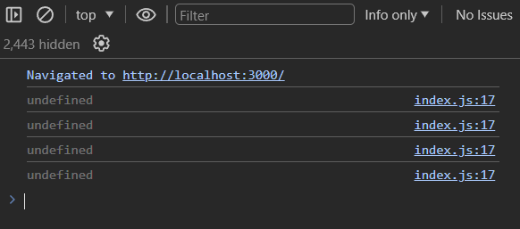
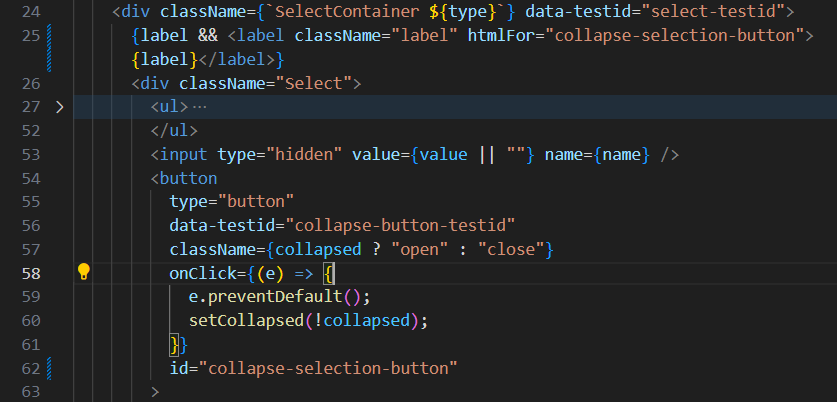
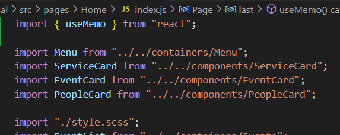
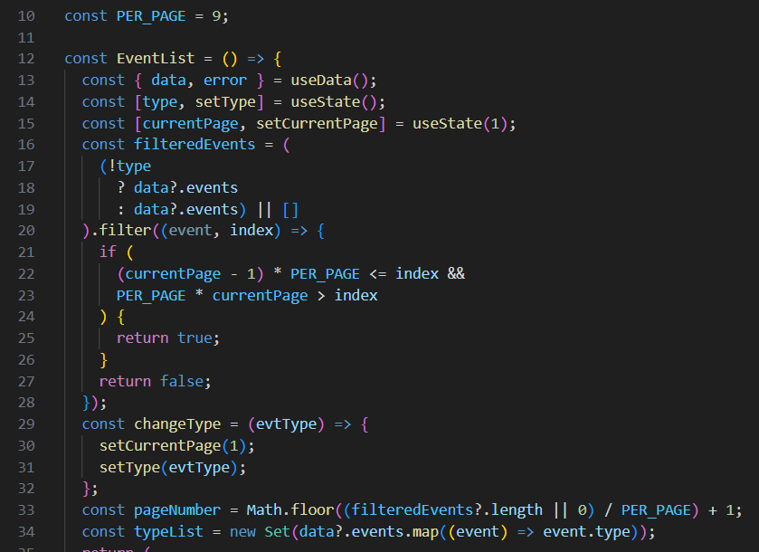
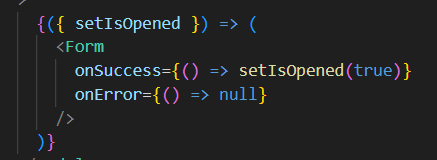
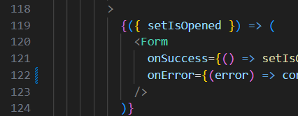

J'ai commencé par résoudre les erreurs en console. Il est important de commencer par les premières car les suivantes peuvent parfois être dûes aux erreurs précédentes (*les erreurs peuvent s'enchaîner*).

#### Des props non initialisés

Voici les premières erreurs que j'ai reçues en console :


Je les ai regroupées car elles ont lieu dans le même composant et que le message est similaire à part qu'il porte sur une autre *variable*.

J'ai donc cherché l'origine du problème


On reconnaît les props `imageSrc` et `title` vues dans les messages d'erreur.


**On constate que les `imageSrc` et `title` n'ont pas de valeurs par défaut.** 

**Est-ce judicieux ?** On pourrait envisager d'en mettre une pour le `title` mais pour le chemin vers une image c'est plus compliqué (*quelle image par défaut ?*) voire même contre indiqué, il vaut mieux que l'on soit avertit (*si une image par défaut est présente il n'y aura plus d'avertissements*).

**Le problème ne vient donc pas du composant en lui-même** mais du composant qui utilise le composant `EventCard`, **il faut qu'il fournisse toutes les données requises en paramètre**. 

Si l'on regarde le message d'erreur l'on voit que **l'erreur a ensuite été remontée vers le *composant* `Page`** :


En cherchant dans le fichier l'on constate qu'**il y a une `EventCard` dans le `<footer>` de la page**.


Il semble qu'il fasse appel à un objet nommée `last`.


J'ai tout d'abord cherché à examiner la valeur de `last` :




On voit clairement qu'il y a un problème : **direction le fichier où est censé être défini `last`.**

```jsx
// /src/contexts/DataContext/index.js
import { createContext, /* ... */ } from "react";
const DataContext = createContext({});

export const DataProvider = ({ children }) => {
  const [error, setError] = useState(null);
  const [data, setData] = useState(null);
  const getData = useCallback(async () => {
    try {
      setData(await api.loadData()); // 2
    } catch (err) {
      setError(err);
    }
  }, []);

  // Ce useEffect n'a pas de "dépendances" il sera donc exécuté à chaque rendu !
  useEffect(() => {
    // Mais une fois les données reçues elle ne fait plus rien.
    if (data) return; 
    getData(); // 1
  });
  
  return (
    <DataContext.Provider
      // eslint-disable-next-line react/jsx-no-constructed-context-values
      value={{ // 3
        data,
        error
      }}
    >
      {children}
    </DataContext.Provider>
  );
};
```

C'est dans une fonction externe (*au composant*) qu'à lieu l'appel à l'API. Comme il n'y a pas encore de *backend* la requête a lieu sur un fichier.

```js
// /src/contexts/DataContext/index.js
export const api = {
  loadData: async () => {
    const json = await fetch("/events.json"); // <<<<
    return json.json();
  }
};
```

Ce fichier se trouve dans le dossier public :


C'est un fichier JSON qui consiste en un objet contenant de nombreuses données et **c'est très exactement cet objet qui est renvoyé au composant `<DataProvider>`**. 

Nous sommes plus particulièrement intéressé par les propriétés de *premier niveau* car de **la manière dont `last` est *destruturé* il ne peut pas être *imbriqué*  dans un autre objet**.

Rappel :


Or nous constatons qu'il n'y a pas de propriété nommée `last`.


Il faut donc d'une certaine manière générer cette "donnée".

**Ce problème a été vu durant la vidéo de présentation, il s'agit de la carte dans laquelle doit être affichées les informations sur le dernier événement ayant eu lieu.**

Les données de chaque événement sont de cette forme, et **ce qui nous intéresse surtout c'est la date** :

```js
"events": [
    {
        "id": 1,
        "type": "conférence",
        "date": "2022-04-29T20:28:45.744Z", // <----
        "title": "User&product MixUsers",
        "cover": "/images/alexandre-pellaes-6vAjp0pscX0-unsplash.png",
        "description": "Présentation des nouveaux usages UX.",
        "nb_guesses": 900,
        "periode": "14-15-16 Avril",
        "prestations": [
            "1 espace d’exposition",
            "1 scéne principale",
            "1 espace de restaurations"
        ]
    },
    {
        "id": 2,
        "type": "expérience digitale",
        "date": "2022-01-29T20:28:45.744Z", // <----
        "title": "#DigitonPARIS",
        "cover": "/images/charlesdeluvio-wn7dOzUh3Rs-unsplash.png",
        "description": "Présentation des outils analytics aux professionnels du secteur ",
        "nb_guesses": 1300,
        "periode": "24-25-26 Février",
        "prestations": [
            "1 espace d’exposition",
            "1 scéne principale",
            "1 site web dédié"
        ]
    },
    {
        "id": 3,
        "type": "conférence",
        "date": "2022-03-29T20:28:45.744Z", // <----
        "title": "Conférence &co-responsable",
        "cover": "/images/chuttersnap-Q_KdjKxntH8-unsplash.png",
        "description": "Débats et échanges autour des collaborations eco-responsable.",
        "nb_guesses": 600,
        "periode": "24-25-26 Février",
        "prestations": [
            "1 scéne principale",
            "1 espaces de restaurations",
            "1 site web dédié"
        ]
    },
    {
        "id": 4,
        "type": "conférence",
        "date": "2022-08-29T20:28:45.744Z", // <----
        "title": "Conférence #productCON",
        "cover": "/images/headway-F2KRf_QfCqw-unsplash.png",
        "description": "Présentation des outils analytics aux professionnels du secteur ",
        "nb_guesses": 1300,
        "periode": "24-25-26 Février",
        "prestations": [
            "1 espace d’exposition",
            "1 scéne principale",
            "2 espaces de restaurations",
            "1 site web dédié"
        ]
    },
    // ...
]
```

**Comme `last` n'est utlisé que dans le composant `<Page>` c'est à cet endroit que j'ai décidé de procéder à l'opération qui consiste à récupérer les données sur le dernier événement ayant eu lieu.**

Comme **c'est une opération qui pourrait, à la longue, devenir assez coûteuse** (*en fonction de la quantité d'événements*) j'ai décidé de mémoïser les données du dernier événement afin que l'opération n'ait lieu qu'une seule fois. Cela dit comme l'exécution de l'opération est dépendante aux mutations faites sur l'objet `data` on s'assure que la date du dernier événement sera réévaluée si les données venait à changer.


***


Voilà le résultat :


***


Ces avertissements proviennent de React, j'ai vu que pour résoudre le problème il faut remplacer les `defaultProps` par des valeurs que l'on va passer par défaut dans les props.

Exemple avec le composant `<Logo>` :


Il reste néanmoins un problème car maintenant nous avons des erreurs de compilation supplémentaires :


C'est très contradictoire : mais qui a raison ?

Après avoir fait quelques recherches, il s'avère que les defaultProps sont dépréciés et en voie de disparaître. Je suis tombé sur [un message intéressant sur stack overflow](https://stackoverflow.com/questions/78338167/i-have-an-error-that-eslintreact-require-default-props-with-eslint-plugin-react) qui dit :

> `defaultProps` is deprecated and going to be removed. You should do both of the following:
>
> 1. Go ahead and entirely remove AccordionDemo.defaultProps = { ... } from your code.
>
> 2. Turn off the `react/require-default-props` ESLint rule. How to do this depends on how you've configured eslint, but common places to set it are `tsconfig.json`, `eslintrc`, or `inline` (e.g. // eslint-disable-next-line eslintreact/require-default-props)
>
> Read more about this deprecation at: https://sophiabits.com/blog/stop-using-defaultprops


***


Des erreurs assez banales, comme le JSX est au final du JavaScript, l'on ne peut pas écrire des variables avec un tiret, il faut donc les modifier en `camelCase` :


Correction :


***

Il reste encore des erreurs de compilation :


Pas de label.


C'est assez logique qu'il y ait une erreur car il y a deux problèmes :

1. L'élément `label` n'est pas un vrai élément `label` sémantiquement parlant
2. Le bouton n'a pas d'identifiant unique (*id*)





J'ai dû être plus explicite en ajoutant l'attribut `aria-labelledby` ainsi qu'un attribut `id` au label.


***


***


Je n'ai pas pu trouvé la raison exacte (je parle d'un point de vue technique), je pense donc que ça fait partie des « bonnes pratiques » de React. Après y avoir un peu plus réfléchi je pense que c'est une question de dépendances entre les fichiers, il est plus probable que nos composants dépendent de React que l'inverse, il paraît donc plus logique de l'importer en premier.




***


De ma faute, je préfère cette notation car je la trouve plus lisible dû à la coloration syntaxique. 


Je me suis tout de même renseigné pour voir si il y avait de bonnes raisons d'éviter cette notation et je suis tombé sur un post datant de **2012** :


La partie importante est celle-ci :

> Because of an error in the language definition, reserved words cannot be used in the dot notation, but they can be used in the subscript notation.

J'ai fait un essai :

```js
const test = {
    class: "foo",
    const: "bar",
    undefined: "bad ?"
};

test.class = "foo2";
test["class"] = "foo3";

test.const = "baz";
test["const"] = "bazz";

test === undefined;

console.dir(test);
```

Je n'ai rencontré aucun problème à l'exécution alors que j'aurai dû en rencontrer si l'on en croit ce qui a été dit plus tôt :


J'ai fait d'autres recherches et je suis tombé sur ce post de 2013 :


Un mise à jour du langage a eu lieu qui permet désormais donc l'utilisation des mots clés réservés en tant que propriété d'un objet.

J'ai été lire la spec qui dit :


J'ai cherché un peu plus loin encore et je suis tombé sur ce post : https://stackoverflow.com/questions/40209367/do-reserved-words-need-to-be-quoted-when-set-as-property-names-of-javascript-obj

Qui donne un exemple auquel je n'avais pas pensé :

```js
const test = {
    class: "foo",
    name: "John"
};

const { class } = test; // << ERREUR !
const { name } = test;
```

Mais on peut quand même s'en sortir en renommant la propriété :

```js
const { class: classe } = test;
console.log(classe);
```

**Au final, j'estime qu'il n'y a plus vraiment de raison de s'empêcher d'utiliser cette *notation* car les spécifications du langage ont été revus et n'empêche plus d'utiliser des mots clés réservés en tant que propriété d'un objet, il est vrai que je l'ai peu rencontré dans les divers code source que j'ai pu lire je pense que ça s'explique simplement : c'est plus simple à écrire.**

*Historique des liens visités : ["https://stackoverflow.com/questions/13271116/why-does-jslint-prefer-dot-notation-over-square-bracket", "https://crockford.com/javascript/survey.html", "https://stackoverflow.com/questions/7022397/using-reserved-words-as-property-names-revisited", "https://stackoverflow.com/questions/40209367/do-reserved-words-need-to-be-quoted-when-set-as-property-names-of-javascript-obj", "https://2ality.com/2015/08/object-literals-es5.html#you_can_use_reserved_words_as_unquoted_property_keys", "https://stackoverflow.com/questions/68000574/what-s-the-difference-between-identifier-and-identifiername-in-ecmascript-20", "https://stackoverflow.com/questions/8099270/use-of-reserved-words-in-javascript", "https://stackoverflow.com/questions/31765627/how-come-if-this-is-a-reserved-word-in-javascript-im-still-able-to-set-it-as-a"]*

Mais comme nous sommes plusieurs sur le projet, je préfère respecter cette règle, j'ai donc modifié mon code :


***


Après quelques recherches j'ai compris que cela est en rapport avec le fait que je retourne des types de variable différents au sein d'une même fonction :

```js
const last = useMemo(() => {
  if(! data) return; // retourne 'undefined'
  const lastEvent = data.events.reduce((previousEvent, currentEvent) => {
    const previousEventDate = new Date(previousEvent.date);
    const currentEventDate = new Date(currentEvent.date);
    return currentEventDate > previousEventDate ? currentEvent : previousEvent;
  });
  return lastEvent; // retourne un 'objet'
}, [data]);
```

*lien visité: https://stackoverflow.com/a/65460560*

La solution :

```js
const last = useMemo(() => {
  if(! data) return {}; // retourne un objet
  const lastEvent = data.events.reduce((previousEvent, currentEvent) => {
    const previousEventDate = new Date(previousEvent.date);
    const currentEventDate = new Date(currentEvent.date);
    return currentEventDate > previousEventDate ? currentEvent : previousEvent;
  });
  return lastEvent; // retourne un objet
}, [data]);
```

J'ai rencontré un problème intéressant à la suite de cette modification.


Ce qui se passe c'est que lors du premier rendu `data` est vide ce qui fait que la fonction renvoie un objet vide :

```js
const last = useMemo(() => {
  if(! data) return {};
  // ...
}, [data]);
```

`last` n'est donc plus *falsy* : lorsqu'il est évalué dans une expression booléenne il renvoie *true* ce qui fait que même en l'absence de données le composant `<EventCard>` sera rendu. Pour remédier au problème, je teste non seulement `last` mais aussi la présence de l'une des propriétés requises (*preuve que les données ont été reçues*).


***


***

Plus d'erreurs de compilation ! Mais lorsque j'ai rafraîchit la page ...


```js
const Slider = () => {
  const { data } = useData();
  const [index, setIndex] = useState(0);
  const byDateDesc = data?.focus.sort((evtA, evtB) =>
    new Date(evtA.date) < new Date(evtB.date) ? -1 : 1
  );
  const nextCard = () => {
    setTimeout(
      () => setIndex(index < byDateDesc.length ? index + 1 : 0),
      5000
    );
  };
  
  useEffect(() => {
    // La fonction nextCard est appelée alors qu'il n'y a pas encore de données
    // En l'absence de données "byDateDesc" aura la valeur "undefined" ce qui 
    // provoque l'erreur lorsque le timer arrive à zéro
    nextCard();
  });
  // ....
}
```

Solution :


***


Il est difficile à la seule vue du code source de déterminer le ou les éléments qui posent problème, une technique que j'utilise est de copier l'élément (et ses descendants) depuis le DOM est de le copier dans un fichier pour mieux analyser le code :

```html
<section class="SliderContainer">
    <div class="SlideCardList">
        <div class="SlideCard SlideCard--hide">
            <!-- Contenu de la carte -->
        </div>
        <div class="SlideCard__paginationContainer">
          <div class="SlideCard__pagination">
            <input type="radio" name="radio-button" checked="">
            <input type="radio" name="radio-button">
            <input type="radio" name="radio-button">
          </div>
        </div>
        <div class="SlideCard SlideCard--hide">
          <!-- Contenu de la carte -->
        </div>
        <div class="SlideCard__paginationContainer">
            <div class="SlideCard__pagination">
              <input type="radio" name="radio-button">
              <input type="radio" name="radio-button" checked="">
              <input type="radio" name="radio-button">
            </div>
        </div>
        <div class="SlideCard SlideCard--display">
          <!-- Contenu de la carte -->
        </div>
        <div class="SlideCard__paginationContainer">
            <div class="SlideCard__pagination">
              <input type="radio" name="radio-button">
              <input type="radio" name="radio-button">
              <input type="radio" name="radio-button" checked="">
            </div>
        </div>
    </div>
</section>
```

Présenté de la sorte le problème devient plus évident, neuf *radio buttons* sont rendus alors qu'il ne devrait y en avoir que 3.


```jsx
{byDateDesc?.map((event, idx) => (
  <>
    <div
      key={event.title}
      className={`SlideCard SlideCard--${
        index === idx ? "display" : "hide"
      }`}
    >
      {/* Affichage contenu de la carte */}
    </div>
    <div className="SlideCard__paginationContainer">
      <div className="SlideCard__pagination">
        {byDateDesc.map((_, radioIdx) => (
          <input
            key={`${event.id}`}
            type="radio"
            name="radio-button"
            checked={idx === radioIdx}
          />
        ))}
      </div>
    </div>
  </>
))};
```

Le code de génération des *radio buttons* se trouve dans la boucle de génération des cartes, la solution a été de déplacer la boucle de génération *radio buttons* :


Il a fallu faire quelques ajustements :


Le problème est que les objets *event* n'ont pas de propriété nommée `id` :


Il a été assez simple de résoudre le problème : j'ai simplement remplacé l'id par l'index :


J'ai alors eu une erreur de compilation :


Que j'ai résolu en utilisant l'une des propriétés de l'objet `event` passé en paramètre :


***


En fait il faut comprendre ce message du point de vue de l'utilisateur final, React nous prévient que l'utilisateur final ne pourra pas changer l'état de l'input car l'on a pas branché de fonction (*onChange*) qui lui permettent de changer l'état. Pour spécifier à React que c'est ce comportement que l'on souhaite il faut être explicite et ajouter la propriété `readOnly` avec la valeur `true`.

*lien vers la documentation à ce propos : https://react.dev/reference/react-dom/components/input#controlling-an-input-with-a-state-variable*


Ce que j'en comprends c'est qu'en utilisant une chaîne de caractère quelque soit sa valeur elle sera toujours égal à true.


C'est la documentation de React qui m'a induise en erreur :


Ce que le message d'erreur veut dire c'est que lorsqu'un attribut sert de booléen (true/flase) sa seule présence suffit à donner la valeur `true` :


***

À ce stade nous n'avons plus d'erreur ; ni de compilation ni durant l'exécution (*runtime*).

Mais il y a encore au moins un problème au niveau du Slider : à chaque cycle de rendu des slides il y en a un ou il n'y a rien d'afficher (*il y a un blanc*).


Ce qui est intéressant c'est de voir qu'à ce moment ci aucun des trois *radio buttons* n'est *coché* ; cela indique à mon avis qu'il y a un dépassement d'index. En informatique les indices des tableaux démarre le plus souvent à zéro et je pense que le problème réside au niveau de cette ligne :

```js
const nextCard = () => {
  setTimeout(
    () => setIndex(index < byDateDesc.length ? index + 1 : 0),
    5000
  );
};
```

Il y a trois *radio buttons* donc `byDateDesc.length` doit être égal à 3, or les indices commencent à 0 ce qui fait que lorsque la condition est vérifiée :

0 < 3
1 < 3
2 < 3
3 < 3 // Trop tard !

Solution :


Avant de continuer une dernière amélioration que l'on peut faire serait de mémoïser le tableau `byDateDesc` afin de ne pas avoir à refaire un tri à chaque nouveau rendu :


***

En ce qui concerne les tests il y en a 5 qui ne passent pas :


Les mois sont affichés sur les autres cartes mais pas sur l'une d'elle :


Si l'on regarde bien on constate qu'il y a un décalage d'un mois entre le mois en base de données et le mois affiché :


L'erreur doit se situer dans la fonction `getMonth()` :


Si l'on se réfère à la doc de getMonth de l'API Date : 


***




Comme indiqué dans le message du test lorsque l'on sélectionne une catégorie rien ne se passe : 


Lors du chargement de la page :


Lorsque l'on sélectionne une catégorie (un appel de plus) :


En revanche, l'on constate que le processus de filtration n'a plus lieu ensuite (quelque soit la sélection que l'on fait).

Qu'est ce qui provoque la mise à jour du tableau `filteredEvents` ? C'est la valeur de `type` :


Je vérifie qu'un événement ait bien lieu à chaque fois que l'on sélectionne une catégorie :


J'ai testé en cliquant sur toutes les catégories : je peux confirmer que l'événement est bien appelé à chaque fois mais on voit qu'il y a clairement un problème avec la valeur de `evtType` :


Difficile de voir ce qui cloche à première vue allons voir le composant Select :


Une fois de plus il n'est pas évident de détermniner ce qui cloche à la seule vue du code.

J'ai décidé de copier l'élément Select présent dans le DOM pour voir si il n'y a pas un souci au niveau des attributs (ça me permettra d'obtenir une piste) :

```xml
<div class="Select">
    <ul>
        <li class="SelectTitle--show">Toutes</li>
    </ul>
    <input type="hidden" name="select" value="">
    <button type="button" data-testid="collapse-button-testid" class="open" aria-label="Voir la liste des catégories">
        <!-- CODE SVG -->
    </button>
</div>
```

Ça ne m'aide pas beaucoup plus à vrai dire - étonné de voir que la liste ne contient qu'un élément : je l'ai étendu pour voir en cliquant sur le composant :


```xml
<div class="Select">
    <ul>
        <li class="SelectTitle--hide">Toutes</li>
        <li><input name="selected" type="radio" checked=""> Toutes</li>
        <li><input name="selected" type="radio"> conférence</li>
        <li><input name="selected" type="radio"> expérience digitale</li>
        <li><input name="selected" type="radio"> soirée entreprise</li>
    </ul>
    <input type="hidden" name="select" value="">
    <button type="button" data-testid="collapse-button-testid" class="close" aria-label="Voir la liste des catégories">
        <!-- CODE SVG -->
    </button>
</div>
```


La valeur est bien transmise :


Le type de l'événement est bien transmis et on voit que le processus de filtration a bien lieu à chaque fois que l'on sélectionne une autre catégorie.


Néanmoins l'on constate que la liste des événements reste inchangée :


Le type de l'événement n'est pas pris en compte dans le processus de filtration.


Le processus de filtration fonctionne.


Mais il y a encore un petit problème, lorsque l'on sélectionne la catégorie "Toutes" plus aucun événement n'est affiché :


Autre problème lorsque l'on sélectionne "Toutes" la liste des options ne se rétracte pas :


`!collapsed` reste positif même en l'absence de valeur, lorsque l'on passe le state à null il reste donc positif, il vaut mieux utiliser une valeur booléenne :


Problème résolu :


***


On voit tout d'abord que la fonction `onSuccess` n'est jamais appelée


Correction :


Je me demande d'où provient `setIsOpened` car on ne le trouve pas dans le fichier `Home.js` ni dans le composant `Form`, peut-être dans le composant `Modal` :


Je comprends mieux maintenant d'où ça vient.

J'aimerais déjà voir comment se comporte le formulaire pour le moment :


Tout à l'air de fonctionner correctement !

Rappel de l'erreur lors du test :


Ce que je constate c'est qu'il semble qu'aucun champs du formulaire ne soit rempli je vais voir ce que ça produit en live :


Ça fonctionne ...

Je pense que le problème vient du test, il cherche après un élément qui a le texte "Envoyer" et simule un click dessus (le clic a t-il lieu au bon endroit ?)


Il semble que oui !

Je pense que le problème provient des deux lignes suivantes :


car lorsque l'on clique sur Envoyer il se passe un certain temps avant le message de succès ne s'affiche :


(*Voir le timer à 500ms*)

Pour le vérifier on peut essayer de supprimer le timer pour voir :


J'ai relancé le test :


Et c'est effectivement le code de test qui pose problème. Deux solutions :
- retirer le timer
- modifier le code du test

Je préfère la seconde car cette opération lorsqu'elle aura lieu en réalité prendra un certain temps.


On voit que l'on peut passer d'autres paramètres à la méthode `findByText()`.


J'ai relancé tous les tests et je n'en ai plus eu aucun qui a échoué.


***

Parmi les autres problèmes que j'ai détecté il y en a un qui est assez embêtant : lorsque l'on clique sur les liens de navigation situé en en-tête du site rien ne se passe :


Je considère que c'est un bug et c'est assez facile à corriger :


***

Rédaction de tests :

J'ai découvert un test qui n'a pas été implémenté :


Et un autre :


En réalité je ne comprends pas vraiment l'utilité de ce test, mais peut être que ça peut avoir un lien avec la sécurité, le code SVG peut-il contenir du code "malicieux" ? Le code SVG peut poser des problèmes de sécurité mais je n'ai rien vu à propos des coordonnées du *path* (*dans d*).

J'ai ajouté un testid


J'ai découvert d'autres tests qui n'ont pas été implémentés.


Pour déterminer si une liste d'événements est bien présenté à l'utilisateur, je pensais au début faire un `querySelectorAll` sur les éléments mais j'ai appris que c'est une mauvaise pratique car les tests ne devraient pas être dépendants de l'implémentation : [Get by HTML element with React Testing Library?](https://stackoverflow.com/a/54250578) et même si je choisissais de faire comme cela il serait difficile de distinguer les événements car une fois dans le DOM ce sont de simples éléments `<div>`.


En cherchant un peu plus je suis tombé sur [cet article qui parle de l'attribut `data-testid`](https://kentcdodds.com/blog/making-your-ui-tests-resilient-to-change#whats-with-the-data-testid-query). C'est un attribut spécifique aux tests et donc l'on peut être (*toujours relativement*) sûr qu'il ne sera pas modifié même si l'implémentation change.

Tout ce qu'il me reste à faire à présent est de vérifier la présence d'éléments ayant cet attribut avec l'id `card-testid`. Est-ce que c'est assez pour autant, il se trouve qu'il y a une autre `EventCard` dans le footer de la page :


Et donc si on ne fait pas attention, notre test ne sera pas fiable. La librairie de test fournit une fonction `within` qui permet de faire des tests à l'intérieur d'un éléement, les EventCards qui nous intéressent sont dans une section qui a un attribut `id` :


Est-ce une bonne idée d'utiliser l'attribut `id` dans nos tests : dans ce cas de figure ça semble assez sûr qu'il ne changera pas néanmoins je pense que c'est mieux d'être plus spécifique en utilisant aussi un `data-testid` :


J'ai rencontré des problèmes que je n'ai pas su résoudre, j'ai décidé de tenter d'écrire d'autres tests ...

****


Le test passe bien, la raison étant que la liste de personnes n'a pas besoin de *data provider* on verra juste après la véritable raison.


***

J'ai fini par comprendre ce qui empêchait le test consistant à vérifier la présence des événements dans la liste : Jest ne connait pas par défaut la fonction `fetch` car c'est une fonction que l'on trouve uniquement dans l'environnement d'un navigateur or Jest ne connaît que l'environnement de NodeJS qui ne possède pas de fonction `fetch` (*ce n'est plus le cas aujourd'hui*) comme le contexte fait appel à la fonction `fetch` et qu'elle n'existe pas les données ne sont jamais récupérées.

Pour résoudre le problème, il suffit de mocker la fonction `fetch` :


La variable `dataMock` est un objet contenant un extrait des données de tests :


J'ai appris qu'il est préférable de mocker les appels aux API car :

1. cela accélère les tests (on peut toujours simuler de la latence si nécessaire)
2. cela coûte moins cher (un appel à une API réelle peut avoir un coût financier)


Et pour la carte dans le `<footer>` :


Liens :

- Pourquoi mocker les requêtes à l'API ? https://www.youtube.com/watch?v=TBZy-Rc-xX0&list=PL4cUxeGkcC9gm4_-5UsNmLqMosM-dzuvQ&index=13

pagination
formulaire

inverser le tri


//////////////////////////////////////////////// ARCHIVES

> Il existe une règle d’or quand on écrit un test unitaire : si vous ne pouvez pas réaliser votre test facilement, c’est que votre code est trop compliqué et doit être simplifié. ()

On est censé écrire des tests mais je n'ai pas vraiment d'idées. Puis j'en ai eu une quand même qui consiste à faire une analyse de la couverture de code testé : je me dit que ça va peut être m'aider à trouver des idées de tests :


Mais Jest n'est pas *directement* utilisé apparemment ...


Qu'est ce que *react-scripts* ?

Quand on fait une recherche sur *react-scripts* on finit par tomber sur le package `Create React App`.


J'ai utilisé la ligne de commande indiquée mais je n'avais pas résultats :


En fait il fallait ajouter en paramètres `watchAll=false` :

Ce qui donne :

> npm test -- --coverage --watchAll=false

J'ai rencontré des problèmes mais j'ai fini par obtenir un rapport de couverture des tests :


/// ARCHIVES ///

Autre problème la carte du dernier événement ne s'affiche plus : 


Aucune erreur en console, aucune erreur de compilation.


J'ai vérifié la valeur renvoyée par la condition :


Après coup je me suis rendu compte que l'erreur était évidente, je traitais un objet comme un tableau (*Array*).

J'ai modifié la condition en testant plutôt la présence d'une propriété.


C'est corrigé :


On voit aussi que `onError` passe un *objet* `err` mais qu'il n'est pas récupéré dans le code client :



L'erreur ne provient pas du code client car la signature de la fonction en props n'indique pas qu'un paramètre va être passé :


Recevoir les éventuelles erreurs risque de faciliter le débogage, j'ai donc décidé de corriger le problème :


Plus de problème de compilation.



///

AUTRE TODO :

Ajouter des required sur le formulaire de contact et modifier les tests en conséquence
Il ne se passe rien lorsque l'on clique sur la carte du dernier événement dans le footer (ajouter un modal ? comme les autres events ?)